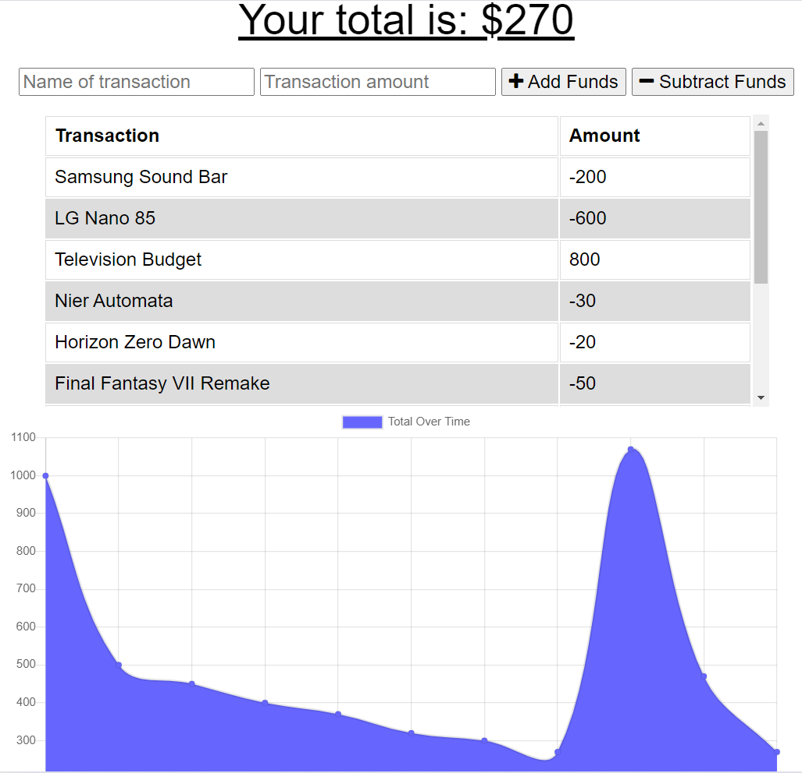

# Budget Tracker
Application used to track money transactions, used specifically for staying around a budget.

## Features
* Add or subtract money from a budget.
* Allows descriptions for all transactions, so you know their purpose.
* Has the ability to work offline, once it has been loaded at least once.
* Has the ability to update the online transactions once you have sucessfully come back online.
* Uses a graph to track your transactions over time.

## Potential Future Upgrades
* Allow use of multiple different budgets to track budgets for multiple people. (Like a budget for each kid.)
* Add an optional description for what kind of money was used for keeping track of the transactions. (Credit Card, Cash, Debit Card, etc.)

## Screenshot

## Website
https://arcane-thicket-29860.herokuapp.com/